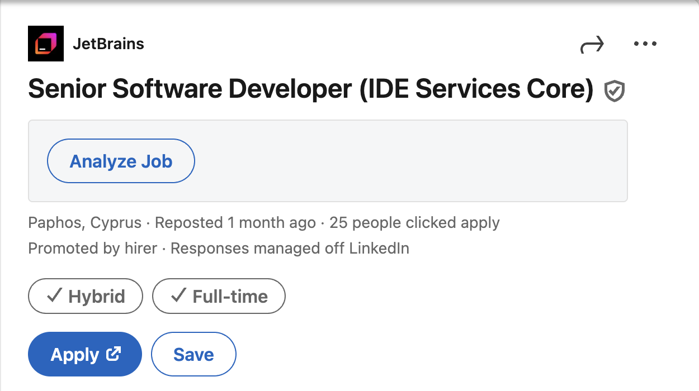

# Better LinkedIn Extension

A browser extension that enhances LinkedIn job listings by analyzing job descriptions and extracting
key technical information targeted for developers, such as programming language and role. It will update
the LinkedIn page to display the analysis result. It relies on **Gemini API** to perform the analysis.

My problems with LinkedIn's job search are the lack of a language filter and precise search. For example,
when you search for a specific backend language, LinkedIn will expand the search results to include
other backend languages. That's why I've created this extension to mitigate this problem a little bit
to display the job post language, the main programming language, the role, and the seniority level.

I designed this extension and implemented it with the help of LLMs, and I can see the code is not up
to standards. However, it works fine for my personal use for now. Feel free to tailor it to your needs.

## Installation

Right now, this extension is not published on the Chrome Web Store. But you can install it using the
developer mode

1. Download the latest version from the [releases](https://github.com/mohammad-alwa/better-linkedin-jobs/releases)
page.
2. Open chrome://extensions then enable the *developer mode* toggle.
3. Drag and drop the downloaded folder to the extensions page.

## Usage

### Setup

1. Click on the extension icon in the browser toolbar.
2. Enter a valid Gemini API key.
3. Click on the *Save API Key* button.
4. Enable *Auto Analysis* checkbox if you want the extension to analyze jobs automatically without clicking
 the *Analyze Job* button manually.

### Analysis

1. Navigate to LinkedIn job search or any job details page.
2. Click on the *Analyze Job* button under the job title, If you enabled *Auto Analysis* then this
step is not required.
3. View the extracted details under the button.

